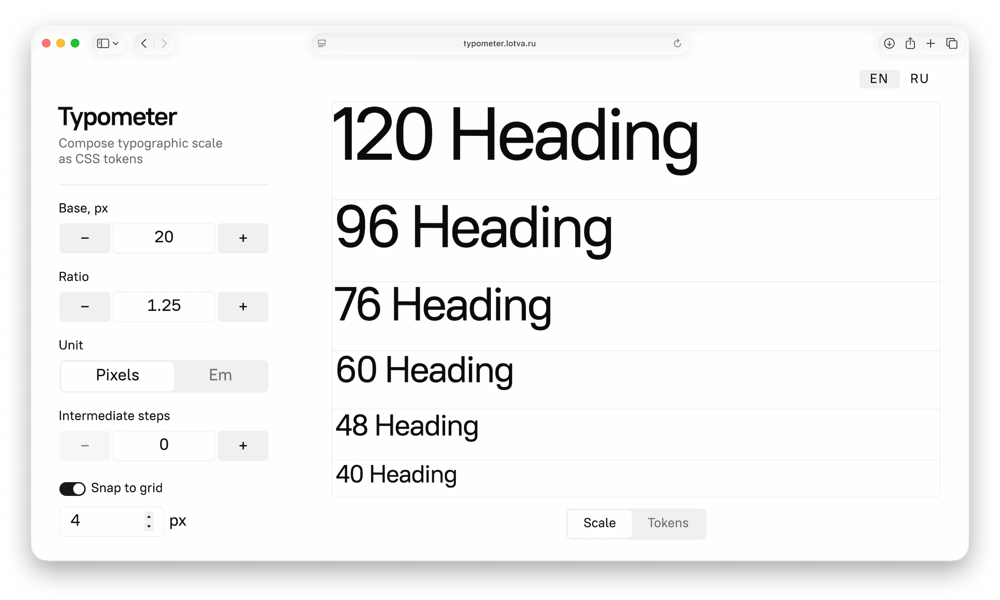

[](https://github.com/lotva/typometer/actions/workflows/check-types.yaml) [](https://github.com/lotva/typometer/actions/workflows/run-lighthouse.yaml) [](https://github.com/lotva/typometer/actions/workflows/check-scripts.yaml) [](https://github.com/lotva/typometer/actions/workflows/check-styles.yaml) [](https://github.com/lotva/typometer/actions/workflows/check-formatting.yaml)

# Typometer


A typographic scale builder for UI engineers and design system maintainers. Generates consistent CSS `font-size` tokens based on geometric progression and the classic typographic scale.

**Fluid typography.** Type scales smoothly from mobile to desktop without breakpoints.

**Pure CSS output.** Uses native `pow()` and `clamp()` functions. No preprocessors required.

**Curated presets.** Choose from industry-standard intervals to jumpstart your type set.

**Shareable URLs.** Settings are synced to the URL for instant sharing and bookmarks.

**PWA.** Works offline and supports full keyboard navigation.

🔗 https://typometer.lotva.ru/

<a href="https://typometer.lotva.ru/">
	
</a>

## Development

Start the dev server:

```bash
pnpm install
pnpm dev
```

Build and preview a static production bundle:

```bash
pnpm generate
pnpm preview
```

Update dependencies:

```bash
pnpx npm-check-updates
pnpm install
```

Install skills:

```bash
pnpx skills add addyosmani/web-quality-skills
pnpx skills add vuejs-ai/skills
```

## Tech Stack

| Category  | Technologies                            |
| --------- | --------------------------------------- |
| Framework | TypeScript, Vue 3, Nuxt 4, Pinia        |
| UI        | PostCSS, Ark UI                         |
| Linting   | Prettier, Stylelint, Oxlint, Commitlint |
| Tooling   | Rolldown, Lefthook, pnpm                |

## Project Structure

**Architecture: FEOD.**

The codebase is organized into `core`, `pages`, `views`, `modules`, and `common` directories.

Each directory is divided into `config`, `lib`, `model`, and `ui` segments.

[FEOD documentation (Russian)](https://habr.com/ru/companies/sportmaster_lab/articles/972410/)

## References

[The typographic scale](https://spencermortensen.com/articles/typographic-scale/) — Spencer Mortensen

[Building Typographic Scales in CSS with :heading(), sibling-index(), and pow()](https://www.alwaystwisted.com/articles/building-typographic-scales-with-headings-sibling-index-and-pow.html) — Always Twisted

[CSS Type Casting to Numeric: tan(atan2()) Scalars](https://dev.to/janeori/css-type-casting-to-numeric-tanatan2-scalars-582j) — Jane Ori

[Every Layout: Modular scale](https://every-layout.dev/rudiments/modular-scale/) — Heydon Pickering & Andy Bell

[Fluid heading styles](https://carbondesignsystem.com/elements/typography/type-sets/#fluid-heading-styles) — Carbon Design System

[How to name design tokens](https://thedesignsystem.guide/design-tokens-naming-playbook) — The Design System Guide

[Modular grid](https://guides.kontur.ru/principles/base/grid/) — Kontur Guides

[Typemetric](https://design.profi.travel/typemetric) — Profi.Travel Design Guide

[Font size ratios](https://t.me/ne_znal_ai/1498) — Sergey Steblina

---

# Типометр


Конструктор типографической шкалы с экспортом в CSS-токены. Адресован разработчикам интерфейсов и авторам дизайн-систем.

Фичи: флюидная типографика, пресеты, PWA и работа в офлайне, сохранение состояния в URL, хоткеи.

🔗 https://typometer.lotva.ru/

## Команды для разработки

Запустить дев-сервер:

```bash
pnpm install
pnpm dev
```

Собрать и развернуть локально статический билд:

```bash
pnpm generate
pnpm preview
```

Обновить зависимости:

```bash
pnpx npm-check-updates
pnpm install
```

Подключить скиллы:

```bash
pnpx skills add addyosmani/web-quality-skills
pnpx skills add vuejs-ai/skills
```

## Стек

| Категория | Технологии                              |
| --------- | --------------------------------------- |
| Фреймворк | TypeScript, Vue 3, Nuxt 4, Pinia        |
| Интерфейс | PostCSS, Ark UI                         |
| Линтеры   | Prettier, Stylelint, Oxlint, Commitlint |
| Тулинг    | Rolldown, Lefthook, pnpm                |

## Файловая структура

**Архитектурная методология — FEOD.** Код поделён на директории `core`, `pages`, `views`, `modules` и `common`; директории поделены на сегменты `config`, `lib`, `model`, `ui`.

_[Документация FEOD](https://habr.com/ru/companies/sportmaster_lab/articles/972410/)_

## Источники

[The typographic scale](https://spencermortensen.com/articles/typographic-scale/). Spencer Mortensen

[Building Typographic Scales in CSS with :heading(), sibling-index(), and pow()](https://www.alwaystwisted.com/articles/building-typographic-scales-with-headings-sibling-index-and-pow.html). Always Twisted

[CSS Type Casting to Numeric: tan(atan2()) Scalars](https://dev.to/janeori/css-type-casting-to-numeric-tanatan2-scalars-582j). Jane Ori

[Every Layout: Modular scale](https://every-layout.dev/rudiments/modular-scale/). Heydon Pickering, Andy Bell

[Fluid heading styles](https://carbondesignsystem.com/elements/typography/type-sets/#fluid-heading-styles). Carbon Design System

[How to name design tokens](https://thedesignsystem.guide/design-tokens-naming-playbook). The Design System Guide

[Модуль](https://guides.kontur.ru/principles/base/grid/). Гайды «Контура»

[Типометрия](https://design.profi.travel/typemetric). Гайды «Профи-трэвел»

[Соотношение кеглей](https://t.me/ne_znal_ai/1498). Сергей Стеблина
