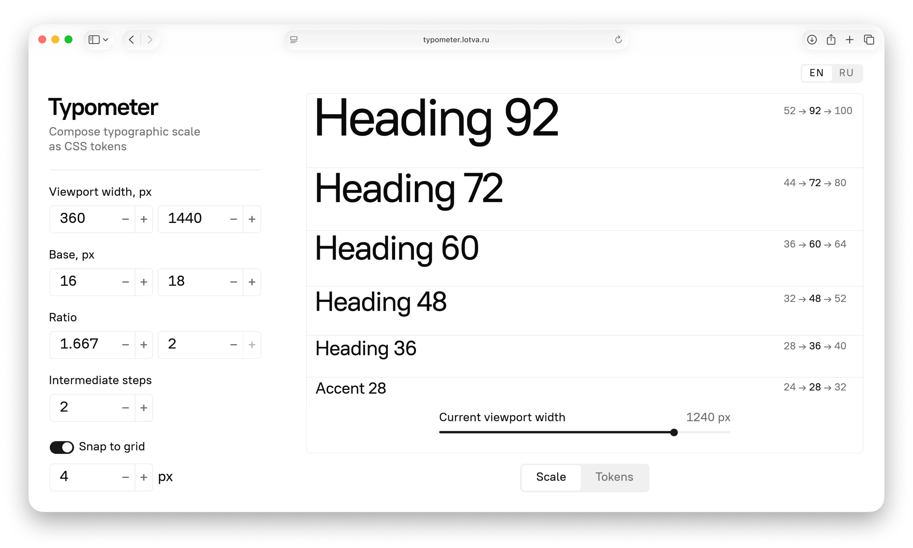

# Typometer


A typographic scale builder that turns two viewport-bound type configs into CSS custom properties. Type grows with the window, and larger steps grow faster than the base. You edit the tokens in the project — no preprocessor, no `@media (768px)` / `(1024px)` / `(1440px)` stack for font size.

**Fluid typography.** One `--progress` value interpolates between `--vw-min` and `--vw-max`. The same signal can drive tracking and leading.

**Geometric scale.** Contrast increases with size: a heading outruns body text as the viewport widens.

**Pure CSS.** Native `pow()`, `clamp()`, and `calc()`. Change settings in the file; you don't need to reopen the site.

**Presets.** Start from Adobe Spectrum, Shopify Polaris, Geist, or a classic interval.

**Shareable URLs.** Settings live in the URL.

```css
:root {
	/* 27px at 320px → 42px at 1440px */
	--fs-xl: calc(1rem * pow(var(--ratio), 5 * var(--step)));
}

.loud {
	font-size: var(--fs-xl);
}
```

🔗 https://typometer.lotva.ru/

<a href="https://typometer.lotva.ru/">
	
</a>

## How to use

Tune the scale in the app, then copy CSS from the _Tokens_ tab.

### Paste into a project

Keep the interpolation block. Delete `--fs-*` tokens the project doesn't need.

```css
/* https://typometer.lotva.ru/#base=16,21&ratio=1.667,2&steps=4&vw=320,1440 */

@property --vi-100 {
	inherits: false;
	initial-value: 0px;
	syntax: '<length>';
}

:root {
	--base-min: 16;
	--base-max: 21;
	--ratio-min: 1.667;
	--ratio-max: 2;

	--vw-min: 320;
	--vw-max: 520;

	--vi-100: 100vi;
	--w: calc(tan(atan2(var(--vi-100), 1px)));

	--progress: clamp(
		0,
		(var(--w) - var(--vw-min)) / (var(--vw-max) - var(--vw-min)),
		1
	);

	--base: calc(
		(var(--base-min) + (var(--base-max) - var(--base-min)) * var(--progress))
	);
	--ratio: calc(
		var(--ratio-min) + (var(--ratio-max) - var(--ratio-min)) * var(--progress)
	);

	--steps: 5;
	--step: calc(1 / var(--steps));

	--fs-s: calc(1rem * pow(var(--ratio), -2 * var(--step)));
	--fs: 1rem;
	--fs-l: calc(1rem * pow(var(--ratio), 2 * var(--step)));
	--fs-xl: calc(1rem * pow(var(--ratio), 4 * var(--step)));
	--fs-2xl: calc(1rem * pow(var(--ratio), 5 * var(--step)));
	--fs-3xl: calc(1rem * pow(var(--ratio), 9 * var(--step)));
}
```

### Interpolate leading and tracking

Reuse `--progress` for `line-height` and `letter-spacing`:

```diff
 :root {
 	/* ... */

+	--tracking-min: 0;
+	--tracking-max: -0.02;
+
+	--leading-min: 1.3;
+	--leading-max: 1.4;
+
+	--tracking: calc(
+		var(--tracking-min) + (var(--tracking-max) - var(--tracking-min)) * var(--progress)
+	);
+	--leading: calc(var(--leading-min) + (var(--leading-max) - var(--leading-min)) * var(--progress));
 }
```

### Add a custom breakpoint

Override bounds for viewports that need separate values:

```diff
 :root {
 	/* ... */

+	@media (width >= 640px) {
+		--base-min: 16;
+		--base-max: 22;
+
+		--leading-min: 1.35;
+		--leading-max: 1.45;
+		--ratio-max: 2;
+
+		--vw-min: 640;
+		--vw-max: 1440;
+	}
 }
```

See [CONTRIBUTING.md](./CONTRIBUTING.md) for local development.

## References

[The typographic scale](https://spencermortensen.com/articles/typographic-scale/) — Spencer Mortensen

[Building Typographic Scales in CSS with :heading(), sibling-index(), and pow()](https://www.alwaystwisted.com/articles/building-typographic-scales-with-headings-sibling-index-and-pow.html) — Always Twisted

[CSS Type Casting to Numeric: tan(atan2()) Scalars](https://dev.to/janeori/css-type-casting-to-numeric-tanatan2-scalars-582j) — Jane Ori

[Every Layout: Modular scale](https://every-layout.dev/rudiments/modular-scale/) — Heydon Pickering & Andy Bell

[Fluid heading styles](https://carbondesignsystem.com/elements/typography/type-sets/#fluid-heading-styles) — Carbon Design System

[How to name design tokens](https://thedesignsystem.guide/design-tokens-naming-playbook) — The Design System Guide

[Modular grid](https://guides.kontur.ru/principles/base/grid/) — Kontur Guides

[Typemetric](https://design.profi.travel/typemetric) — Profi.Travel Design Guide

[Font size ratios](https://t.me/ne_znal_ai/1498) — Sergey Steblina
